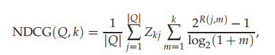

# Chapter 8 - Evaluation in information retrieval

## 8.1. Information retrieval system evaluation

- To measure effectiveness of an IR system, we need a test collection that has these three things:
1. A document collection
2. A test suite of information needs expressible as queries
3. A set of relevance judgements, usually a binary assessment of either relevant or nonrelevant for each query-document pair.

- We need __ground truth/ gold standard__ judgements saying if a query is relevant to a document or not w.r.t a user information need. Binary yes or no for __relevance__.

- We need a reasonably large test collection. Results of the IR system are averaged many test sets, as they are highly variable of different documents and __user information needs__. 50 information needs is considered enough.

- Relevance is assessed relative to an __informtion need__, not a query. A document is relevant if it addresses the information need, and not because it just contains all the query terms. For example, if a user searches for "Python", he could mean the snake or the programming language. Hard to obtain from single word queries.

- Generalized performance should be high, and params should not be tuned to maximize performance on a single test collection. Use a validation set.

## 8.2. Standard test collections

- The Cranfield collection
* too small, pioneering, collected in the UK
* 1398 abstracts, 225 queries, all Q-D relevance judgements.

- TREC - Text Retrieval Conference
* Created by NIST

## 8.3. Evaluation of unranked retrieval sets

- Precision = #(relevant items retrieved)/ #(retrieved items) = P(relevant|retrieved)

- Recall = #(relevant items retrieved)/ #(relevant items) = P(retrieved|relevant)

- P = tp/(tp + fp)
- R = tp/(tp + fn)
- Accuracy = (tp + tn)/ (tp + tn +fp +fn). Not useful since 99% of docs are not relevant. So you always will get a high accuracy.
- Typically, one number is more important than the other in certain situations. In web surfing, we would like all the results on the first page to be relevant (High P). Paralegals want most or all docs relevant to be returned (High R).

- F measure F = 1/((alpha/P) + (1-alpha)/R). P and R are weighted equally when alpha = 0.5
- F1 (beta = 1) = 2PR/(P+R)
- beta < 1 --> more importance to precision
- beta > 1 --> more importance to recall
- Arithmetic mean is unsuitable since returning all docs will give you a 50% F1 score.

## 8.4. Evaluation of ranked retrieval results

- P, R and F-measures are set-based measures. We need new measures for ranked retrival results.

- P-R curves have a saw tooth shape. If the (k+1)th document is relevant, then both P and R increase. If not, then R stays the same, but P decreases.

- The jagged shape can be smoothed out by using interpolated precision. __p_interp (@ some r) = max(precisions for all r' higher than r)__.

- For each recall level from 0.1, 0.2 ... 1.0, interpolated precision is measured and averaged across all information needs. This is then plotted as the final PR curve for the test collection.

- __MAP (Mean Average Precision)__
* Single-figure measure for quality across all recall levels.
* Has good discrimination and stability.
* For a single information need, the AP is defined as the average of P values obtained for the set of top k documents existing after each relevant document is retrieved. This value is then averaged over all information needs to obtain MAP.
* AP roughly represents the area under un-interpolated PR curve.
* So MAP is average area for all such curves across information needs.

- __Precision @ k__
* Precision at a recall of k documents.
* Advantage - no need to know the size of the set of relevant docs.
* Disadvantage - Does not average well. Unstable and is affected by the total number of relevant documents for a query. For example, if there are a very few relevant documents, then precision will be lower no matter what? Since you may reach a relevant document in a very sparse manner?

- __R-Precision__
* Have a set of known relevant documents _Rel_ from which the precision of the top _Rel_ documents returned. R-precision adjusts itself to the size of the set of relevant docs. Even a perfect system could only achieve a precision @ 20 of 0.4, if there were only 8 relevant documents w.r.t. the info. need. But this metric would give a score of 1 as the denominator is 8.

* If there are _|Rel|_ relevant documents for a query, we examine the top _|Rel|_ results of a system and find that _r_ are relevant, then by R-precision and recall are both _r/|Rel|_.

 - __Break-Even Point__ - R-precision == Recall. R-precision describes only one point on the prceision-recall curve. Correlated highly with MAP empirically, despite the above reason.

 - __ROC Curve__ - Receiver operating characteristics.
 * Plots the TP rate (sensitivity) against the FP rate (1 - specificity). Here, sensitivity == recall.
 * FP rate = fp/(fp+tn). Common to report the __area under the ROC curve__.

 - __Cumulative gain & Normalized discounted cumulative gain (NDCG)__
 * designed for situations of non-binary relevance. Evaluated at some number k of top search results. 

